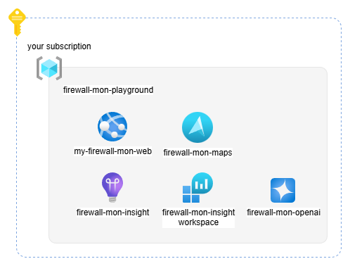

# Install az-firewall-mon in your environment

When installed in your environment, `az-firewall-mon` will deploy the following resources:

Follow these steps to install a private copy of `az-firewall-mon` in your environment:

* Fork the GitHub repository
* Create a GitHub Personal Access Token (PAT)
* Create all Azure resources
* Configure the GitHub Action to deploy both the SPA and the backend API
* Review Environment variables
* Limit access
  
# Fork the GitHub repository

The first step is to fork the `az-firewall-mon` repository. This allows you to pull down and build the latest changes and updates from the original repository while maintaining your own personal copy.

* Navigate to: <https://github.com/nicolgit/azure-firewall-mon>
* Click **Fork** > **Create a new fork** (top right of the repository)
* Click **Create fork**

> You now have a fork of the `az-firewall-mon` repository. When a new update is available, you can select **Sync fork** to keep your fork up-to-date and trigger a new build.

# Create a GitHub Personal Access Token (PAT)

1. Go to your GitHub account settings
2. Select **Developer settings** > **Personal access tokens** > **Tokens (classic)** (<https://github.com/settings/tokens>)
3. Click **Generate new token** > **Generate new token (classic)**
4. Give your token a name like "Azure Static Web App Deployment"
5. Expiration: `No Expiration`
6. Select the following scopes:
   - `repo` (Full control of private repositories)
   - `workflow` (Update GitHub Action workflows)
7. Click **Generate token**
8. **Copy your token** (you won't be able to see it again)

# Create all Azure resources
An instance of `az-firewall-mon` consists of:
* 1 Azure Static Web App (standard plan)
* 1 Azure Maps account
* 1 Azure OpenAI account
* 1 Application Insights instance

You can deploy all these resources to your subscription by clicking the button below:

When deploying, fill in the following parameters:
   - `staticWebAppName`: Name for your static web app
   - `repositoryUrl`: Your GitHub repository URL (e.g., `https://github.com/username/azure-firewall-mon`)
   - `repositoryToken`: Your GitHub PAT created in the previous step
   - `branch`: Your main branch (typically 'main')

This will create also an action in your repository that builds and deploys the solution to Azure.

Go to `https://github.com/YOUR-GITHUB-ACCOUNT/azure-firewall-mon/actions` to see the deployment status. When deployment is complete, navigate to Azure Portal > Static Web Apps > View app in browser

# Review environment variables 

`az-firewall-mon` requires several environment variables to function properly. These variables are configured automatically during deployment. Here's a reference in case you need to change any:

* **APPLICATIONINSIGHTS_CONNECTION_STRING**: Application Insights connection string 
    
Azure Maps settings:
* **ip_api_key**: Azure Maps API key
* **ip_throttling_calls**: '1'
* **ip_throttling_window_milliseconds**: '1000'

With these settings IP API will return a `429` status code if you make more than 1 call to IP API per second (1000 milliseconds)

Azure OpenAI settings:
* **aoai_api_key**: Azure OpenAI key
* **aoai_endpoint**: Azure OpenAI endpoint
* **aoai_deployment**: Azure OpenAI deployment name
* **llm_throttling_calls**: '5'
* **llm_throttling_window_milliseconds**: '60000'

With these settings Chat API will return a `429` status code if you make more than 5 calls per minute (60000 milliseconds)

Angulare application settings:
* **spa_applicationinsights_connection_string**: Application Insights connection string 
* **spa_builddate**: build timestamp
* **spa_local_queuelength**: 100000

> **spa_local_queuelength** is the number of log items that are kept client-side in the browser. When the number of log items in the event-hub is greater than this number, only the latest ones are kept and all others are deleted. 

# Limit access
After setup is complete, anyone with a valid Microsoft account can access your copy of `az-firewall-mon`. If you want to restrict access, you have several options:

* [Static Web App Private Endpoint](https://learn.microsoft.com/en-us/azure/static-web-apps/private-endpoint): Expose `az-firewall-mon` on a private IP in your virtual network connected via site-to-site VPN or ExpressRoute to your intranet. This makes the tool available only to your company's employees.

* [Static Web App Authorization](https://learn.microsoft.com/en-us/azure/static-web-apps/authentication-authorization): Since `az-firewall-mon` is a Microsoft account-authenticated app, you can configure a list of emails authorized to access it. The file to update, `staticwebapp.config.json`, is located in [./firewall-mon-app/src/assets](./firewall-mon-app/src/assets/staticwebapp.config.json).

