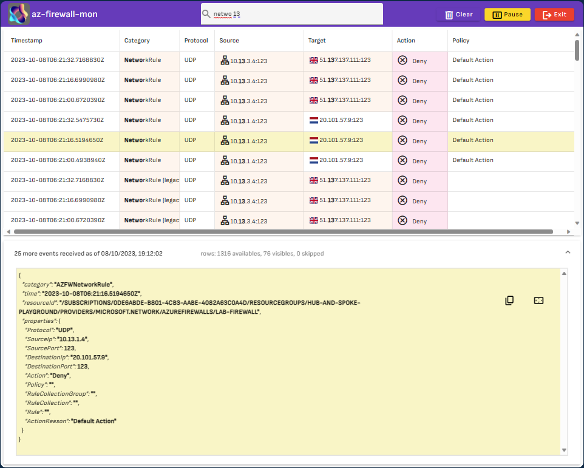
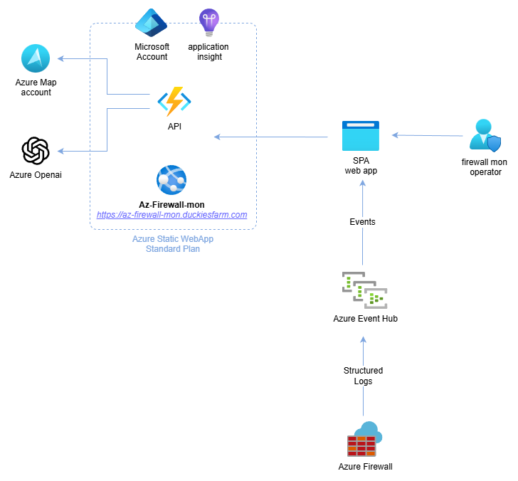

<h1 align="center">az-firewall-mon🧑‍🚒</h1>

  an <i>alternative and opinionated</i> way to access and inspect Azure Firewall logs

 

  built by
  <a href="https://github.com/nicolgit">nicolgit</a> and
  <a href="https://github.com/nicolgit/azure-firewall-mon/contributors">
    contributors
  </a>

 

We all know that Microsoft's recommended approach for analyzing Azure Firewall logs is to set up a Log Analytics Workspace to collect all the data and use Kusto Query Language (KQL) queries to check the results. 

Azure-Firewall-mon focuses more on providing a tool that can answer the simple question "_what is happening right now?_" in an alternative and practical way. The idea is to provide an approach similar to [Sysinternals Process Monitor](https://learn.microsoft.com/en-us/sysinternals/downloads/procmon) or [Check Point's SmartView/SmartLog](https://sc1.checkpoint.com/documents/R80.40/WebAdminGuides/EN/CP_R80.40_LoggingAndMonitoring_AdminGuide/Topics-LMG/Using-log-view.htm?tocpath=Logging%7C_____2), where you don't need to implement KQL queries or dashboards first to get it working. All events are available as a _log-stream_.

The real strength of the tool is the search field available in the top toolbar. To search for an event, simply start typing and the log flow will be automatically filtered according to those parameters.

The timestamp field displays the event date in UTC or local format. You can filter the view for the last few minutes or for a specific time range.

Within this tool, only events from the last 24 hours will appear because this is the duration set on the Event Hub Namespace. A longer duration would slow down the tool and not help answer the question "_what is happening right now?_" that az-firewall-mon aims to address.

As an alternative to full-text search, you can use the **chatGPT mode**: in the top search field, you can enter a request in natural language, and the system will filter the content accordingly.

Some examples of queries are as follows:

* "_Show me events from the last 15 minutes_" 
* "_Search project alpha_" 
* "_Filter rows with category containing "NetworkRule"_" 
* "_Filter events between 12:00 and 13:00_" 
* "_Filter for target containing 192.168.1.1_" 
* "_Include only logs with protocol TCP_" 
* "_Show me only the deny actions_" 
* "_More information on source 192.168.1.1_"

# Set up a connection with your Azure Firewall
Azure-Firewall-mon is an open-source [Single Page Application](https://en.wikipedia.org/wiki/Single-page_application) written in [Angular](https://angular.io/) with an [Azure Functions](https://learn.microsoft.com/en-us/azure/azure-functions/functions-overview) backend written in C# .NET. 

Here's the current architecture:

To use this app with **YOUR FIREWALL data**, you have 2 options:

1. Use the Azure Firewall mon sample deployment available at <https://az-firewall-mon.duckiesfarm.com> 
2. Deploy Azure Firewall mon in your environment

The recommended option is number 2, as this way you can be 100% sure your logs are not going outside your environment. I suggest using the public deployment only for testing purposes.

> <https://az-firewall-mon.duckiesfarm.com> uses resources from my subscription (Azure Maps API, Azure OpenAI, Azure Static Web App Standard). These resources have a cost, so I am limiting their usage as much as possible. As a result, the tool may be quite slow. In your own deployment, you can dedicate more resources and achieve better performance.

# Use az-firewall-mon sample deployment
To use this version with your data, you must perform the following steps on your Azure Subscription:

1. Create an Azure Event Hub Namespace
2. Create an Azure Event Hub inside the namespace, with a `1-day retention` and `1 partition`
3. Create a Shared Access Policy, with _Listen_ claim
4. Open the Azure Firewall instance you want to monitor, go to Monitoring > Diagnostic Settings > Add Diagnostic Settings: 

    - Select _all_ _logs_ and "Stream to Event Hub"
    - Select the Event Hub Namespace and Hub created above
    - click `SAVE`

If you are a lazy engineer, like me, you can perform all these steps by clicking the following button 😊

Open the Azure Firewall instance you want to monitor from the Azure portal, go to Monitoring > Diagnostic Settings > Add Diagnostic Settings:

* Select all logs and "Stream to Event Hub"
* Select the Event Hub Namespace and Hub created above
* Click SAVE

Now, open <https://az-firewall-mon.duckiesfarm.com/> and do the following:

1. Copy the connection string of the Shared Access Policy created above into the `Event Hub Connection String` field
2. Copy the corresponding `Event Hub Consumer Group` name
3. Click on `Let's begin`.

# Install az-firewall-mon in your environment

To install az-firewall-mon in your environment, follow [this guide](INSTALL.md). Once the instance is ready and working, you can go back and follow the instructions in the [Use az-firewall-mon sample deployment](#use-az-firewall-mon-sample-deployment) section. Just replace the URL with the one from your deployment.

# More Information

[Azure Firewall](https://learn.microsoft.com/en-us/azure/firewall/overview) (AF) is a cloud-native and intelligent network firewall security service that provides best-of-breed threat protection for your cloud workloads running in Azure. It's a fully stateful, firewall-as-a-service with built-in high availability and unrestricted cloud scalability. It provides both east-west and north-south traffic inspection.

[Azure Monitor](https://learn.microsoft.com/en-us/azure/azure-monitor/overview) helps you maximize the availability and performance of your applications and services. It delivers a comprehensive solution for collecting, analyzing, and acting on telemetry from your cloud and on-premises environments. 

Azure Firewall is integrated with Azure Monitor. This means you can forward Azure Firewall metrics and logs to:

* Log Analytics Workspace
* Azure Storage
* Event Hub

A [Log Analytics workspace](https://docs.microsoft.com/en-us/azure/azure-monitor/logs/log-analytics-workspace-overview) is a unique environment for log data from Azure Monitor and other Azure services. Each workspace has its own data repository and configuration but might combine data from multiple services.

Be mindful that the ingestion of logs into a Log Analytics workspace has some latency, so you may see a delay before logs are displayed.

Latency refers to the time between when data is created on the monitored system and when it becomes available for analysis in Azure Monitor.

The [Kusto Query Language](https://learn.microsoft.com/en-us/azure/data-explorer/kusto/query/) (KQL) is a tool to explore your data in a Log Analytics Workspace. The query uses schema entities that are organized in a hierarchy similar to SQL's: databases, tables, and columns.

# UIs and tools that inspired Az-Firewall-mon

## [Check Point's SmartView](https://community.checkpoint.com/t5/Management/SmartView-Accessing-Check-Point-Logs-from-Web/td-p/3710) web log access

## SysInternals [process monitor](https://learn.microsoft.com/en-us/sysinternals/downloads/procmon)

# Credits

* [90342-security.json](https://lottiefiles.com/90342-security) lottie animation by Kawsar Mahmud
* [lf20_giodppcr.json](https://lottiefiles.com/95739-no-connection-to-internet) lottie animation by hdev coder
* [rubik.json](https://lottiefiles.com/animations/abstract-modular-cube-1-INITf22TH2) lottie animation by Ision Industries
* Logo built with the [new Bing](https://www.bing.com/new)

